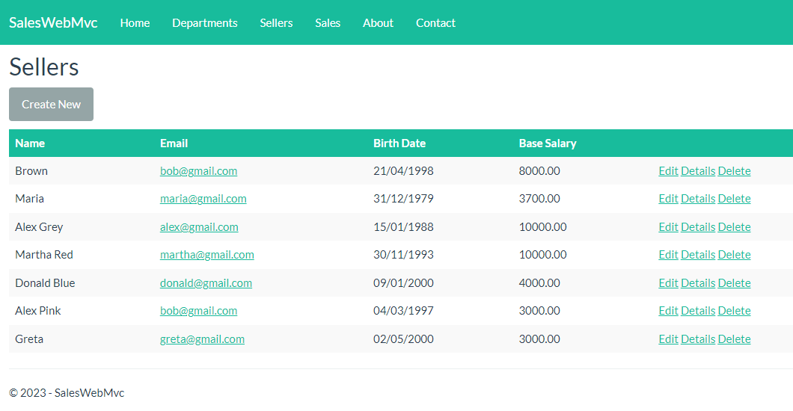
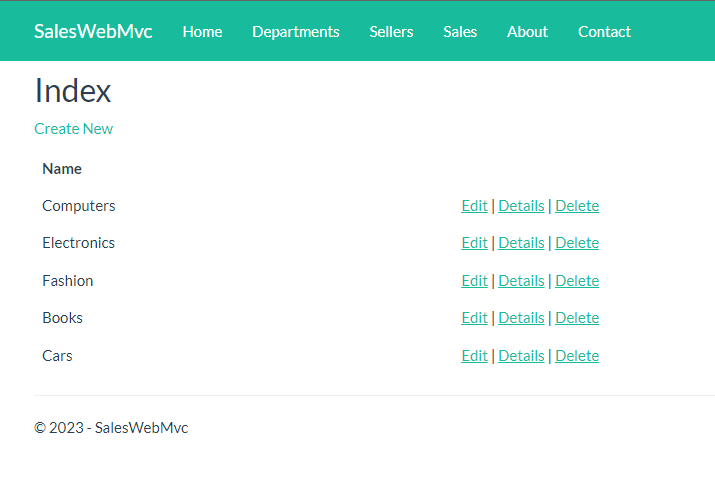
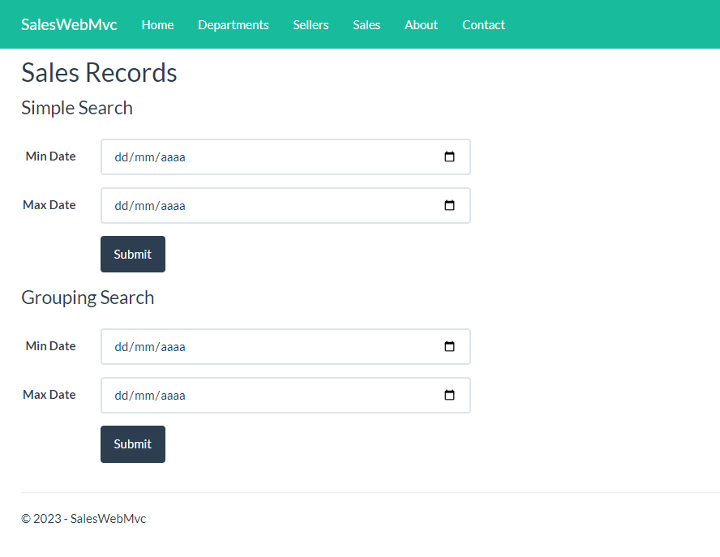
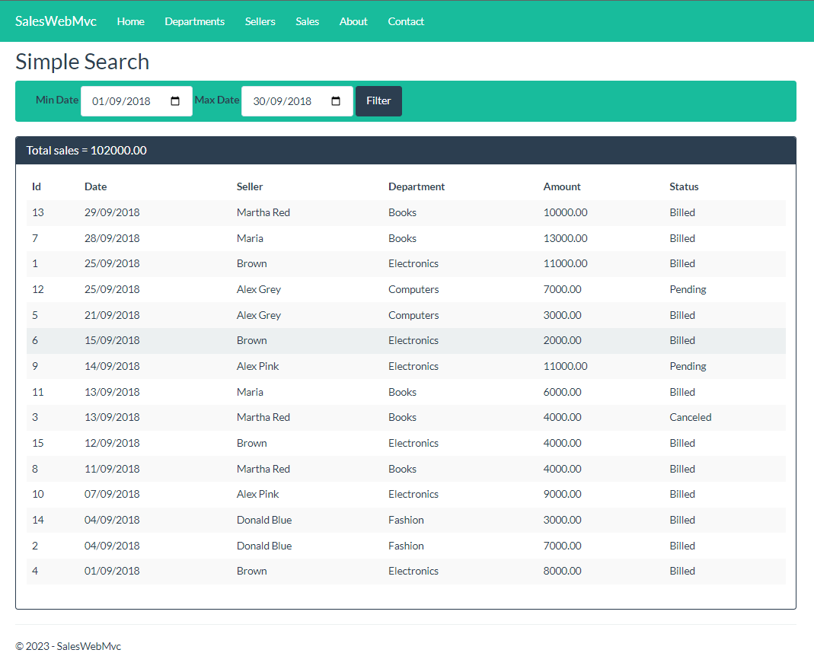
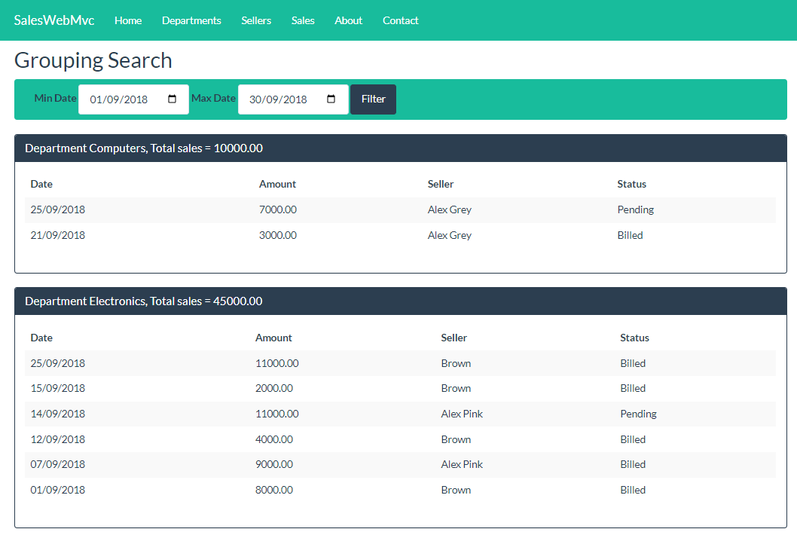

# Sales Web MVC 

Um sistema de gerenciamento de vendas com funcionalidades de criação, exclusão, edição e pesquisa de funcionários, departamentos e registros de vendas. Desenvolvido utilizando C#, .NET Framework, ASP.NET 2.1, Visual Studio 2019, Bootstrap e JavaScript para manipulação do DOM.

## Descrição

Este CRUD de Vendas é uma aplicação web que permite o gerenciamento eficiente das vendas de uma empresa. Com ele, é possível cadastrar novos funcionários, definir seus departamentos e registrar todas as vendas realizadas. A aplicação oferece uma interface intuitiva e amigável, proporcionando uma experiência fluida e fácil de usar para os usuários.

Recursos principais:
- Cadastro, exclusão, edição e pesquisa de funcionários.
- Cadastro, exclusão, edição e pesquisa de departamentos.
- Registro de vendas, incluindo informações como data, cliente, produto e valor.
- Interface responsiva e estilizada com Bootstrap, garantindo uma experiência agradável em dispositivos móveis e desktops.
- Integração com JavaScript para manipulação dinâmica do DOM, tornando a interação com a aplicação mais ágil e fluida.

O projeto segue o padrão de arquitetura MVC (Model-View-Controller), que permite uma separação clara das responsabilidades e uma organização estruturada do código. O MVC é composto pelos seguintes elementos:

- **Model**: Representa a camada de dados e lógica de negócios da aplicação. Aqui, são definidos os modelos de dados, as classes de acesso a banco de dados e as regras de negócio relacionadas aos dados.
- **View**: Responsável pela interface do usuário, exibindo os dados e interagindo com o usuário. Neste projeto, as views são construídas utilizando ASP.NET, HTML e o framework Bootstrap para estilização.
- **Controller**: Encarregado de receber as requisições do usuário, processá-las e coordenar a interação entre o modelo e a view. Os controllers manipulam as ações do usuário, consultam os dados no modelo e retornam as views correspondentes.

Adotar o padrão MVC traz diversos benefícios, como a separação de preocupações, facilitando a manutenção e evolução do código, além de promover a reutilização de componentes e facilitar os testes unitários.

Além disso, o projeto também segue os princípios SOLID, um conjunto de princípios de design de software que visam facilitar a criação de sistemas mais flexíveis, extensíveis e de fácil manutenção. Os princípios SOLID são:

- **S** - Princípio da Responsabilidade Única (Single Responsibility Principle): Cada classe deve ter apenas uma única responsabilidade.
- **O** - Princípio do Aberto-Fechado (Open-Closed Principle): As classes devem estar abertas para extensão, mas fechadas para modificação.
- **L** - Princípio da Substituição de Liskov (Liskov Substitution Principle): As classes derivadas devem ser substituíveis por suas classes bases.
- **I** - Princípio da Segregação de Interface (Interface Segregation Principle): As interfaces devem ser específicas para os clientes que as utilizam.
- **D** - Princípio da Inversão de Dependência

 (Dependency Inversion Principle): Dependa de abstrações, não de implementações.

Esses princípios ajudam a criar um código mais modular, flexível e de fácil manutenção, permitindo que o sistema possa evoluir com mais facilidade ao longo do tempo.

## Tecnologias Utilizadas

- C#
- .NET Framework
- ASP.NET 2.1
- Visual Studio 2019
- Bootstrap
- JavaScript

## Objetivo Futuro

Um objetivo futuro para o projeto é a migração para os Serviços da Azure, permitindo a hospedagem online do CRUD de Vendas. Ao utilizar os recursos da Azure, a aplicação poderá ser acessada de qualquer lugar, eliminando a necessidade de instalação local. Além disso, a Azure oferece escalabilidade, segurança e facilidade de gerenciamento, tornando-a uma opção atraente para hospedar aplicativos web.

## Capturas de Tela

Tela de Vendedores 
 

Tela de Departamentos 
 

Tela de Vendas 
 

Tela de Busca Simples /
 

Tela de Busca Agrupada 
 

## Instalação e Uso

Para utilizar o CRUD de Vendas, siga as instruções abaixo:

1. Clone o repositório para a sua máquina local.
2. Abra o Visual Studio 2019 e carregue a solução do projeto.
3. Execute a aplicação a partir do Visual Studio.
4. Acesse a aplicação em seu navegador usando o endereço `http://localhost:porta`, onde `porta` é a porta em que a aplicação está sendo executada.
5. Explore as diferentes seções do CRUD de Vendas, crie, exclua, edite e pesquise funcionários, departamentos e registros de vendas.

## Contribuição

Contribuições são bem-vindas! Se você deseja contribuir para o projeto, siga as diretrizes a seguir:

1. Faça um fork do repositório.
2. Crie uma branch com a sua nova feature (`git checkout -b feature/nova-feature`).
3. Commit suas mudanças (`git commit -am 'Adicionar nova feature'`).
4. Faça push para a branch (`git push origin feature/nova-feature`).
5. Abra um pull request, descrevendo suas modificações e suas justificativas.

## Licença

Este projeto está licenciado sob a [MIT License](LICENSE).

## Contato

Se você tiver alguma dúvida, sugestão ou feedback, sinta-se à vontade para entrar em contato.

- E-mail: [wallace.vilela9@outlook.com](mailto:[wallace.vilela9@outlook.com)
- GitHub: [Wallace Vilela](https://github.com/wallacevilela7)

## Agradecimentos

Agradeço a todos, os meus mentores e professores, colegas e contribuidores e usuários que tornaram este projeto possível.

## Referências

- [C# Documentation](https://docs.microsoft.com/en-us/dotnet/csharp/)
- [ASP.NET Documentation](https://docs.microsoft.com/en-us/aspnet/)
- [Bootstrap Documentation](https://getbootstrap.com/docs/)
- [Azure Services](https://azure.microsoft.com/)
 
#### Happy Coding 🚀
